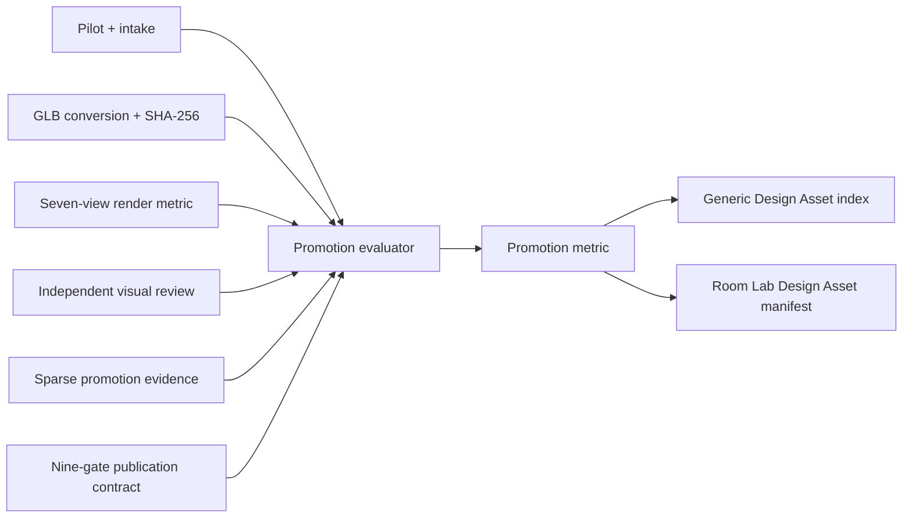

# Design Asset promotion

## Purpose

Promote generic Design Assets from G1 to G2 only when durable, hash-bound evidence satisfies the publication contract. Promotion never creates a Product Twin and never imports commerce or procurement fields.

## Data flow



`data/evidence/kator-legaz-design-asset-promotion-evidence-v0.1.json` is intentionally sparse. An absent claim means `PENDING` and fails closed. A `PASS` or `FAIL` claim requires a reviewer, review time, explanatory note, and at least one durable evidence reference. Runtime-only paths cannot be evidence references.

## Promotion states

- G1: one or more technical gates are false.
- G2, publication blocked: all technical geometry gates pass, but rights, redistribution, attribution display, or stable hosting remains blocked.
- Publishable G2: all nine gates pass and a stable HTTPS asset reference exists.

The six technical G2 gates are dependency resolution, source orientation, back-face policy, texture embedding, canonical-view visual QA, and independent scale QA. Rights and visible attribution remain publication concerns and do not change geometry fidelity.

## Evidence rules

- Evidence is bound to the converted GLB SHA-256.
- Declared-envelope or library metadata cannot satisfy independent scale QA.
- Visual plausibility alone cannot satisfy source rotation, semantic pivot, normals/back-face, or scale gates.
- Canonical visual QA requires all seven views, finite geometry, floor contact and X/Z centring within 1 mm, and an independent review pass.
- Attribution verification must cover `asset_card`, `asset_detail`, `room_selection`, and `export_manifest`.
- A `.runtime` path can never become a public asset reference.
- All Design Asset payloads pass the recursive no-commerce guard.

## Commands

```sh
npm run design:asset:promote
npm run design:asset:promote:test
npm run design:asset:index
npm run design:asset:manifest
```

The promotion command evaluates and writes evidence; it does not upload binaries or publish externally.

## Current Kator/Legaz state

All 12 assets remain G1. Model dependencies pass automatically. The eight manual claims are absent, stable public references do not exist, and the visual review still blocks source rotation, semantic pivot, normals/back-face proof, independent scale, and Room Lab attribution display. The glass dining table additionally fails transparent-material appearance.

## Trade-offs and revisit points

- Sparse evidence avoids copying `PENDING` boilerplate into every record, but reviewers must understand that missing means blocked.
- Geometry G2 is separated from publication so rights or UI work cannot rewrite technical fidelity.
- Stable hosting is an invariant in addition to the nine evidence gates because exposing runtime paths is explicitly forbidden.
- If additional publication surfaces are introduced, update the publication contract first; the promotion evaluator will then require the new complete surface set.
