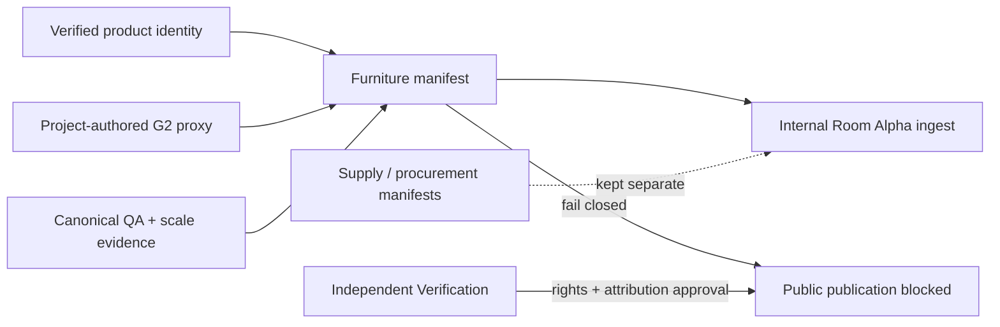

# Furniture Avatar Manifest v0.1 — Brain Checkpoint

Status: checkpoint only. Nothing in this milestone is merged or publicly published.

## Outcome

The first Room Alpha furniture contract contains four primary, internally ingestible G2 planning avatars and one explicitly blocked Arper candidate. Exact retail identity and proxy geometry truth are separate. Procurement, mutable supply, price, stock, merchant and destination-delivery data are outside this manifest.

| Role | Asset | Lane | Geometry | Appearance | Internal Room Alpha | Public |
|---|---|---|---|---|---|---|
| Sofa | IKEA KIVIK 494.405.97 proxy | PRODUCT_TWIN | G2, exact scale, non-exact likeness | Medium; colour/roughness cues, no embedded texture | Allowed | Blocked |
| Lounge chair | IKEA POÄNG 392.407.87 proxy | PRODUCT_TWIN | G2, exact scale, non-exact likeness | Medium; colour/roughness cues, no embedded texture | Allowed | Blocked |
| Coffee/side table | IKEA LISTERBY 305.139.04 proxy | PRODUCT_TWIN | G2, exact scale, non-exact likeness | Medium; material cues, no exact veneer texture | Allowed | Blocked |
| Floor lamp | IKEA LAUTERS 304.050.42 proxy | PRODUCT_TWIN | G2, exact scale, non-exact likeness | Medium; material cues, no exact wood/textile texture | Allowed | Blocked |
| Supplemental blocked table | Arper Ply #3853 | PRODUCT_TWIN | G2; exact manufacturer geometry candidate for G3, not promoted | Low; approved PBR/finish absent | Blocked | Blocked |

## Contract and evidence

- Manifest: `data/geometry/manifests/furniture-avatar-manifest-v0.1.json`
- Schema: `config/geometry/furniture-avatar-manifest-v0.1.schema.json`
- Canonical QA metric: `data/metrics/furniture-avatar-manifest-v0.1-qa.json`
- Pre-Verification visual review: `data/evidence/furniture-avatar-manifest-v0.1-visual-review.json`
- Committed image pack: `data/evidence/furniture-avatar-manifest-v0.1-qa-pack` (28 views plus contact sheets)
- Verification Package #2: `data/verification/packages/furniture-avatar-manifest-v0.1-package-2.json`
- Verification package schema: `config/verification/furniture-avatar-verification-package-v0.1.schema.json`

The four primary GLBs pass world-transformed bounds, independent scale comparison, floor contact, centred anchor, canonical seven-view rendering, front/back or non-directional orientation, collision-envelope comparison and material-cue inspection. They remain G2 because exact visual likeness, embedded texture/PBR finish and authorized manufacturer geometry are not claimed.

## Publication blockers

All four primary assets still require independent approval of the project-authored proxy rights/derivative position and verification that attribution is displayed on every required Room Lab surface. Exact finish and exact likeness remain explicitly unverified. Arper additionally lacks written commercial-rendering and redistribution permission, persistent-binary permission, approved PBR materials and functional-clearance evidence.

Room Lab can safely ingest the four primary assets now for internal planning, collision and circulation previews, while showing the planning-proxy disclosure and source attribution. It must not publish any of the five from this checkpoint.

Verification must independently approve public rights, derivative status, required attribution surfaces, the canonical visual review, and any future exact-likeness or G3 material claim. Arper requires a written permission artifact before its binary may be persisted, rendered commercially or published.

## Deterministic tests

- `npm run furniture:avatar:manifest:test`
- `npm run furniture:avatar:qa:test`
- `npm run furniture:avatar:verification:package`
- `npm run furniture:avatar:verification:test`

Mutation coverage rejects Design Asset product identity and commerce leakage, unverified Product Twin identity, G1 public promotion, unresolved-rights publication, proxy exact-likeness claims, confidence-field leakage, bad geometry hashes and Arper publication bypass.
